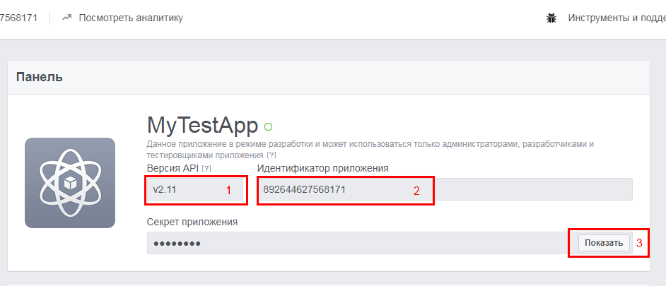
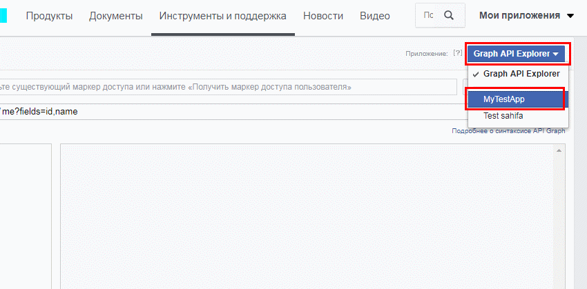

Facebook sozlamalari
--------------------

Facebook ijtimoiy tarmog'idagi sahifangizga kengaytma orqali xabar yuborilishini ta'minlash uchun siz **o'sha sahifa admini** bo'lishingiz va quyidagilarni bajarishingiz kerak.

Facebook da dastur yaratuvchi akkauntini faollashtirish
^^^^^^^^^^^^^^^^^^^^^^^^^^^^^^^^^^^^^^^^^^^^^^^^^^^^^^^

Facebook sahifasiga xabar chop etishda foydalaniladigan dastur yaratish uchun dastur yaratuvchi akkauntini faollashtirishingiz kerak bo'ladi. Buning uchun https://developers.facebook.com/docs/pages/getting-started#developer-account  manziliga kiring va **Создать аккаунт разработчика** tugmasini bosing:

.. image:: fb-1.png

Facebook da dastur yaratish va dastur ma'lumotlarini olish
^^^^^^^^^^^^^^^^^^^^^^^^^^^^^^^^^^^^^^^^^^^^^^^^^^^^^^^^^^

1. Dastur yaratuvchi akkaunti yaratilgandan so'ng sizga dastur yaratish oynasi ochiladi, oynadan **Создать ID приложения** tugmasini bosing:

.. image:: fb-2.png

2. Dastur nomini va pochta manzilingizni kiriting:

.. image:: fb-3.png

3. Dastur yaratilgandan so'ng, chap tarafdan **Панель** bo'limiga kirib, ``api versiyasi`` (1), ``App ID`` (2) va ``Api secret`` (3) larni ko'chirib oling:

.. image:: fb-4.png

Facebook dasturi uchun Access token olish
^^^^^^^^^^^^^^^^^^^^^^^^^^^^^^^^^^^^^^^^^

1. Shundan so'ng https://developers.facebook.com/tools/explorer manziliga kirib, qizil bilan belgilangan joyni bosib, ro'yxatdan dasturingizni tanlang:

2. Rasmda ko'rsatilgan **Получить маркер** tugmasini bosib, eng quyidan **Получит маркер доступа пользователя** ni tanlang va ochilgan oynadan qizil bilan belgilanganlarini tanlab, **Получить маркер доступа** ni bosing:

3. Kichik bir oyna ochilgandan so'ng, davom etish, so'ngra ok tugmasini bosing:

.. image:: fb-8.png

4. Belgilangan joydan tokenni ko'chirib oling:

5. Ko'chirib olingan token **qisqa muddatli token** hisoblanadi. Uni uzoq muddatli tokenga almashtirish uchun dastur Api secret ini hamda dastur ID sini quyidagi linkga qo'yib, o'sha linkni brauzerda oching::

    https://graph.facebook.com/oauth/access_token?client_id=<<Dasturingiz ID si>>&client_secret=<<Dasturingiz API Secreti>>&grant_type=fb_exchange_token&fb_exchange_token=<<Dasturingiz Access tokeni>>

.. image:: fb-10.png
	
6. Natijada siz **uzoq muddatli token** ga ega bo'lasiz. Bu tokenni **hech qachon eskirmaydigan token** ga almashtirish uchun quyidagi linkga uzoq muddatli token ni qo'yib brauzeringizda oching::

	https://graph.facebook.com/me/accounts?access_token=<<uzoq muddatli token ingiz>>

7. Va nihoyat siz **hech qachon eskirmaydigan token** ga ega bo'ldingiz. Bu yerdan ``Sahifa ID`` sini ham olish mumkin:

8. Agar yuqoridagi holatda ``sahifa ID`` siga ega bo'lmasangiz, Facebookdagi sahifangiz manziliga kirib, **Информация** bo'limidan olish mumkin:

.. image:: fb-12.png

9. Olingan ma'lumotlarni kengaytmadagi Facebook sozlamalariga yozib, saqlab qo'ying.
