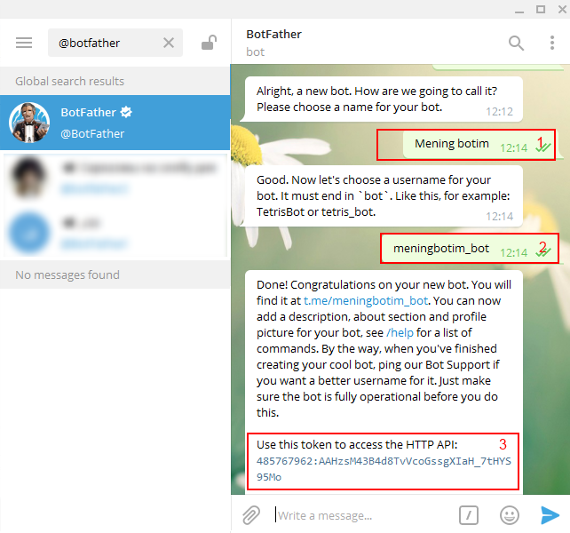

.. Yii2 Autopost documentation master file, created by
   sphinx-quickstart on Tue Nov 21 10:18:16 2017.
   You can adapt this file completely to your liking, but it should at least
   contain the root `toctree` directive.

Yii2 Autopost loyihasining foydalanish qo'llanmasi
==================================================

Imkoniyatlari
-------------

- Sayt orqali Telegram, Facebook hamda Twitter dagi sahifa va kanalga xabarlar chop etish,
- Yuborilgan xabarlar arxivini ko'rish, sayt orqali ularni o'chirish,
- Sahifa orqali sozlamalarni kiritish,
- Yii2 freymvorkida yaratilgan loyihani o'zgartirmagan xolda kengaytmani o'rnatish,
- Bu kengaytmada o'zining url manzili, sozlamalari va sahifalari mavjud

Kengaytmani mavjud loyihaga o'rnatish
-------------------------------------

* Kengaytmani o'rnatish uchun loyihaning composer.json faylining 'require' bo'limiga ``"bzimor/yii2-autopost": "dev-master"`` qatorini qo'shing yoki quyidagi buyruqni ishga tushiring:

``
composer require bzimor/yii2-autopost:dev-master
``

* MySQL ma'lumotlar bazasiga kengaytmaning sozlamalarni saqlash va xabarlar arxivi uchun bazalarni o'rnating:

 * Migratsiya orqali::

	yii migrate --migrationPath=@bzimor/autopost/migrations --interactive=0

 * PhpMyAdmin da .sql faylni import qilish orqali.

Ijtimoiy tarmoq API ma'lumotlarini olish va sozlash
===================================================

Telegram
--------

Telegramda bot yangi bot yaratish
^^^^^^^^^^^^^^^^^^^^^^^^^^^^^^^^^

Telegram kanalida postlarni saytdan turib yoki avtomatik yuborish uchun quyidagi jarayonlarni bajarishingiz kerak:

#. Telegram qidiruv joyiga @botfather deb yozib(1), izlash tugmasini bosing va birinchi chiqqan natijaga kirib "start" tugmasini bosing(2):

.. image:: Telegram_bot_1.png

#. Buyruqlar ichidan ``/newbot`` buyrug'ini tanlang yoki  o'zingiz ``/newbot`` deb yozing:

.. image:: Telegram_bot_2.png

#. So'ngra, so'rovga asosan yaratilayotgan yangi bot ismini (1), botning foylanuv nomini (2) kiritasiz, shundan so'ng sizga Bot token (3) taqdim qilinadi. Botning foydalanuv nomi takrorlanmagan hamda oxiri "bot" yoki "_bot" so'zi bilan tugashi kerak:

Kanal id sini aniqlash
^^^^^^^^^^^^^^^^^^^^^^

#. Kanal id si o'rniga ``@<<kanal_nomi>>`` ni ham ishlatish mumkin. Kanal nomi bu yerda kanal linkining oxirgi qismi: ``https:// t.me/ <<kanal_nomi>>``

.. image:: Telegram_bot_4.png

Agar kanal ochiq bo'lmasa, u holda @getidsbot botini izlab toping, botga kirib ``/start`` ni bosing va kanalingizdagi biror xabarni "forward" qilib botga yuborsangiz, sizning kanalingiz id sini chiqarib beradi.

.. toctree::
   :maxdepth: 2
   :caption: Contents:

Facebook
--------