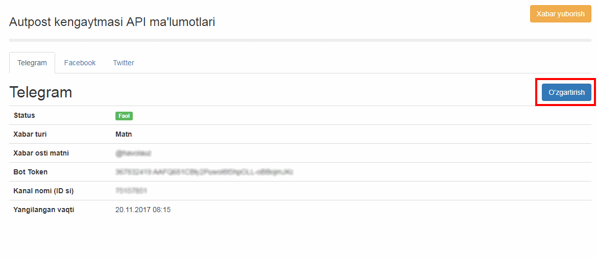
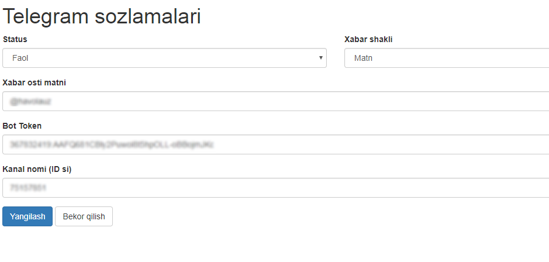

*******************
Kengaytmani sozlash
*******************

Xabarlarni ijtimoiy tarmoqdagi kanal va sahifalarga yuborish uchun avval sozlash menyusi orqali kirib, so'ralayotgan API ma'lumotlarni to'ldirishingiz kerak.

Buning uchun ``http://<<Saytingiz-nomi>>/autopost/setting`` manzili orqali har bir tarmoq bo'limidan **O'zgartirish** tugmasini bosib, o'sha tarmoq sozlamalirini kiritish sahifasiga kiriladi.

