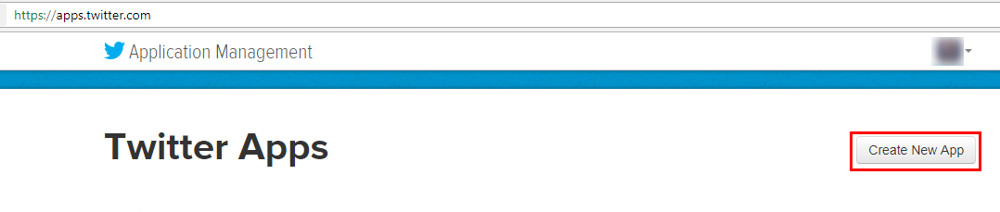
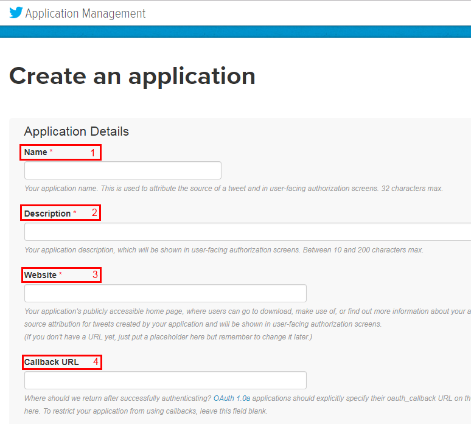
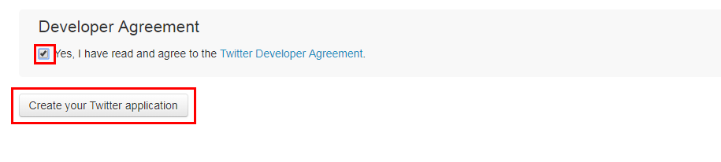
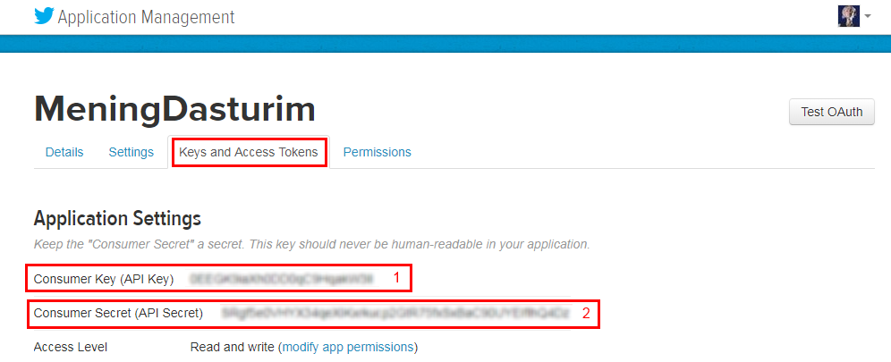
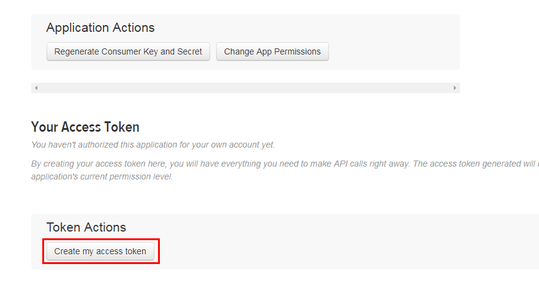
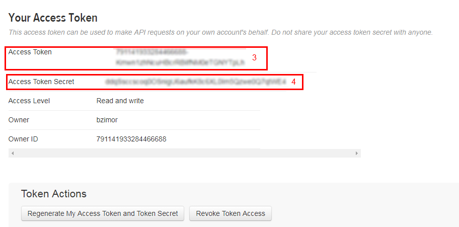

Twitter sozlamalari
-------------------

Twitter ijtimoiy tarmog'idagi sahifangizga kengaytma orqali xabar yuborilishini ta'minlash uchun quyidagilarni bajaring.

Twitter da dastur yaratish
^^^^^^^^^^^^^^^^^^^^^^^^^^

1. Twitter da dastur yaratish uchun https://apps.twitter.com/ manziliga kiring va ``Create New App`` tugmasini bosing:

2. So'ngra dastur nomi(1), dastur haqida ma'lumot(2), vebsayt(3) qatorlarini to'ldiring, shartlarga rozilik belgisini qo'yib, ``Create your Twitter application`` tugmasini bosing:

Dastur ma'lumotlarini olish
^^^^^^^^^^^^^^^^^^^^^^^^^^^

1. Ochilgan oynadan **Keys and Access Tokens** bo'limiga o'ting. Bu yerdan siz ``Api key`` (1) hamda ``Api secret`` (2) larni olishingiz mumkin:

2. Shu sahifaning pastiga tushib, **Create my access token** tugmasini bosing, shunda sizga ``Access token`` (3) va ``Token secret`` (4) taqdim qilinadi:

3. Olingan ma'lumotlarni kengaytma sozlamalaridagi kerakli qatorlarga qo'ying.
